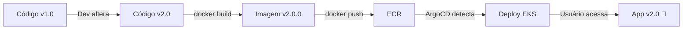

# ✅ SETUP COMPLETO - GitOps Demo v2.0

## 📦 O que foi implementado

### 1. **Código Preparado**
- ✅ `Home.js` configurado com versão 1.0 (sem número de versão)
- ✅ `package.json` em versão 1.0.0
- ✅ Backup original preservado (`Home.js.v1-original`)
- ✅ Material-UI dependências adicionadas
- ✅ Dockerfile ajustado (--legacy-peer-deps)

### 2. **Scripts Criados**

| Script | Descrição | Uso |
|--------|-----------|-----|
| `scripts/demo-update-v2.sh` | **PRINCIPAL** - Demonstração completa GitOps | `./scripts/demo-update-v2.sh` |
| `scripts/update-to-v2.sh` | Atualiza apenas o código fonte para v2.0 | `./scripts/update-to-v2.sh` |
| `scripts/rollback-to-v1.sh` | Reverte código fonte para v1.0 | `./scripts/rollback-to-v1.sh` |

### 3. **Documentação**

| Arquivo | Conteúdo |
|---------|----------|
| `DEMO-V2-GUIDE.md` | Guia completo detalhado |
| `QUICK-DEMO-V2.md` | Resumo executivo |
| `SETUP-COMPLETE-V2.md` | Este arquivo |

---

## 🚀 Como Usar na Demonstração

### **Preparação (Uma vez)**
```bash
# 1. Deploy completo do ambiente
./rebuild-all-with-gitops.sh

# Aguardar ~40 minutos
# Aplicação v1.0 estará rodando
```

### **Durante a Apresentação**

#### 1️⃣ **Mostrar Versão 1.0**
- Acessar aplicação via navegador
- Login/cadastro
- Mostrar: `"Welcome to the E-commerce App"` (sem número de versão)

#### 2️⃣ **Explicar o Cenário**
> "Um desenvolvedor fez uma alteração no código para mostrar que estamos na versão 2.0. Vamos ver o processo GitOps em ação."

#### 3️⃣ **Executar Update**
```bash
./scripts/demo-update-v2.sh
```

O script mostra:
- ✅ Versão atual (v1.0)
- ✅ Código alterado pelo dev
- ✅ Build da imagem
- ✅ Push para ECR  
- ✅ ArgoCD sincronizando
- ✅ Deploy concluído

**Tempo:** 3-5 minutos

#### 4️⃣ **Validar Versão 2.0**
- Recarregar aplicação no navegador
- Login novamente
- Mostrar: `"Welcome to the E-commerce App - Versão 2.0 🚀"`

---

## 🔄 Fluxo Técnico



---

## 📁 Estrutura de Arquivos

```
istio-eks-terraform-gitops-argocd/
├── rebuild-all-with-gitops.sh          # Deploy inicial (v1.0)
├── scripts/
│   ├── demo-update-v2.sh               # ⭐ Demo principal
│   ├── update-to-v2.sh                 # Helper: atualiza código
│   └── rollback-to-v1.sh               # Helper: reverte código
├── microservices/ecommerce-ui/
│   ├── Dockerfile                      # Ajustado com --legacy-peer-deps
│   ├── package.json                    # v1.0.0 → v2.0.0
│   ├── src/pages/
│   │   ├── Home.js                     # Versão 1.0 (inicial)
│   │   └── Home.js.v1-original         # Backup
├── DEMO-V2-GUIDE.md                    # Guia detalhado
├── QUICK-DEMO-V2.md                    # Resumo rápido
└── SETUP-COMPLETE-V2.md                # Este arquivo
```

---

## ✅ Validações

### Código está na v1.0?
```bash
grep "Welcome to the E-commerce App" microservices/ecommerce-ui/src/pages/Home.js
grep '"version": "1.0.0"' microservices/ecommerce-ui/package.json
```

Esperado:
```
<h1>Welcome to the E-commerce App</h1>
"version": "1.0.0",
```

### Scripts têm permissão de execução?
```bash
ls -lh scripts/{demo-update-v2.sh,update-to-v2.sh,rollback-to-v1.sh}
```

Esperado: `-rwxr-xr-x` (executável)

### Docker funcionando?
```bash
docker ps
```

Esperado: Lista de containers (ou vazio, mas sem erro)

---

## 🐛 Troubleshooting Rápido

### Script não executa
```bash
chmod +x scripts/*.sh
```

### Build Docker falha
```bash
# Verificar se Docker está rodando
docker info

# Limpar cache se necessário
docker system prune -a
```

### ArgoCD não sincroniza
```bash
# Forçar sync manual
kubectl patch application ecommerce-staging -n argocd --type merge -p '{"operation":{"sync":{}}}'
```

---

## 🎯 Estado Final do Projeto

| Componente | Status | Versão |
|------------|--------|--------|
| Código fonte | ✅ v1.0 | Pronto para demo |
| Scripts | ✅ Criados | Executáveis |
| Documentação | ✅ Completa | 3 arquivos |
| Dockerfile | ✅ Corrigido | --legacy-peer-deps |
| Dependencies | ✅ Adicionadas | Material-UI |

---

## 📞 Resumo Executivo

**O que você tem agora:**

1. ✅ Projeto configurado com versão 1.0
2. ✅ Script automatizado para demonstração da v2.0
3. ✅ Documentação completa
4. ✅ Fluxo GitOps funcional end-to-end

**Para executar a demo:**

```bash
# 1. Deploy inicial (uma vez)
./rebuild-all-with-gitops.sh

# 2. Na apresentação
./scripts/demo-update-v2.sh
```

**Resultado:** 
- Versão 1.0 → Versão 2.0 automaticamente
- Tempo: ~5 minutos
- Impressionante! 🎉

---

## 🎊 Pronto para Apresentação!

Seu projeto está **100% configurado** para uma demonstração profissional de GitOps.

**Boa sorte na sua apresentação! 🚀**

---

*Última atualização: 30/12/2025*
